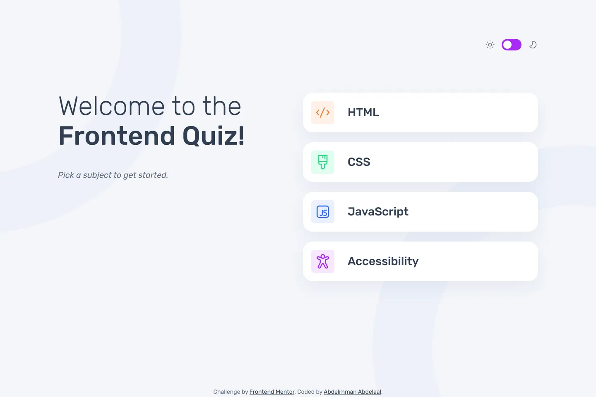

# Frontend Mentor - Frontend quiz app solution

This is a solution to the [Frontend quiz app challenge on Frontend Mentor](https://www.frontendmentor.io/challenges/frontend-quiz-app-BE7xkzXQnU). Frontend Mentor challenges help you improve your coding skills by building realistic projects.

## Table of contents

- [Overview](#overview)
  - [Screenshot](#screenshot)
  - [Links](#links)
- [My process](#my-process)
  - [Built with](#built-with)
  - [Design deviations](#design-deviations)
- [Author](#author)

## Overview

### Screenshot

### Links

- Solution URL: [GitHub](https://github.com/MrBlackvanta/frontend-quiz-app)
- Live Site URL: [Netlify](https://vanta-frontend-quiz-app.netlify.app)

## My process

### Built with

- [Next.js 16](https://nextjs.org/) (App Router, React Compiler, Turbopack)
- [React 19](https://react.dev/)
- [TypeScript](https://www.typescriptlang.org/) (strict)
- [Tailwind CSS v4](https://tailwindcss.com/)

### Design deviations

**Nine of the design's twenty-nine text pairings fail WCAG AA**, and eight non-text pairings fail
1.4.11. Every ratio below is measured against the backdrop the element actually sits on — the
decorative ring counts where text crosses it — and solved on rounded 8-bit channels.

|                                | design                 | contrast                 | shipped                | contrast    |
| ------------------------------ | ---------------------- | ------------------------ | ---------------------- | ----------- |
| Option letter, hover tile      | `#A729F5` on `#F6E7FF` | 4.16                     | `#A729F5` on `#FAF3FF` | 4.52        |
| Option letter, correct (light) | `#FFFFFF` on `#26D782` | 1.89                     | `#FFFFFF` on `#188752` | 4.54        |
| Option letter, wrong (light)   | `#FFFFFF` on `#EE5454` | 3.48                     | `#FFFFFF` on `#E91D1D` | 4.51        |
| Option letter, correct (dark)  | `#FFFFFF` on `#26D782` | 1.89                     | `#313E51` on `#26D782` | 5.74        |
| Option letter, wrong (dark)    | `#FFFFFF` on `#EE5454` | 3.48                     | `#313E51` on `#F38989` | 4.51        |
| Error text (light)             | `#EE5454`              | 3.22, 3.08 over the ring | `#DA1616`              | 4.73 / 4.52 |
| Error text (dark)              | `#EE5454`              | 3.11                     | `#F38989`              | 4.51        |
| Correct fill vs card (light)   | `#26D782`              | 1.89                     | `#188752`              | 4.54        |
| Wrong fill vs card (dark)      | `#EE5454`              | 2.47                     | `#F38989`              | 3.59        |

**No single green or red can serve both themes.** White text on a fill caps that fill's luminance
at 0.183, but clearing 3:1 against the dark card `#3B4D66` needs at least 0.316 — the two
constraints do not overlap, so the state fills invert with the theme. That has the happy side
effect of letting the design's own `#26D782` survive untouched in dark mode: 5.74 against
`#313E51` ink, 4.56 against the card.

**The hover tint moved instead of the brand purple.** `#A729F5` on the design's `#F6E7FF` is 4.16.
Lightening the tint to `#FAF3FF` reaches 4.52 and leaves the brand alone — darkening the purple
would have dragged the button, the progress fill, the selected ring and the toggle with it.

**Three non-text failures ship as drawn.** The selected ring reads 1.75 against the dark card, the
progress fill 1.75 against the dark track, and the toggle pill 2.21 against the dark page. All
three are `#A729F5`, and recolouring the brand per theme costs more than it buys here: the
selected state is also carried by the filled letter tile and the radio's own `checked`, the
progress bar is `aria-hidden` because "Question 6 of 10" states the same thing in text, and the
toggle's state is carried by the knob against its track (4.91) plus `aria-checked`.

**Nothing has a designed hover state except the option cards.** The file has "Active and Hover"
frames for the question options only. The subject cards borrow the option card's selected
treatment — a 3px inset accent ring — and the primary button's hover is `#950BEA`, the brand
purple eight HSL lightness points down, white label at 5.98.

**Every text node in all 27 frames measures zero letter-spacing**, so there are no tracking tokens.

**Line heights are stated as `100%` almost everywhere, and 1.0 is not shippable for anything that
wraps.** The design's sample options are "4.5 : 1"; the real ones run to 60 characters and wrap to
three lines, where 1.0 leading collides. The option labels, the caption line and desktop's
"out of 10" carry 1.5 instead. The only pair the file leaves unstated is the two-line display
heading, derived from its box spacing: 48px apart at 40px (1.2) and 72px apart at 64px (1.125).

**The display heading carries `margin-block: -0.25rem`.** Figma's 100%-leading boxes have no
half-leading, while a wrap-safe CSS line box adds half the leading at each end — which is 4px at
both sizes (40 × 0.2 / 2 and 64 × 0.125 / 2). Without the trim every heading's ink sits 4px below
the design.

**The display size is `clamp(2.125rem, 10.667vw, 2.5rem)`.** 10.667vw is exactly 40px at the
design's 375px frame, so nothing changes there. Pinned at 40px the start-menu heading breaks to
four lines below that; the clamp resolves to 34px and two lines at 320px.

**Radii are normalised, because the file draws each one two ways.** The letter tile is 4px in the
header, subject menu and score card but 6px on the question options; it ships at 6. Its larger
counterpart is 12px on the tablet frames and 8px on desktop; it ships at 8.

**The desktop content edge is normalised to 1300.** The question frame runs to 1300, the header and
score frames to 1297. The header row also starts at y=83 where 80 makes 80 + 56 + 88 land content
on the design's own 224 — so the theme toggle sits 3px right of and 3px above the drawn position,
and the content below it is exact.

**Columns are proportional, not fixed.** The design draws 465 + 131 + 564 on the question screen
and 450 + 143 + 564 on the score screen; both ship as `40fr / 49fr` over a 128px gap. The right
column's edge, height and radius land exactly, and its left edge sits 4.2px left of the drawn one.

**The desktop progress bar is 12px above where the design puts it.** The design pins it at y=660
inside a left column frozen at 452px tall — a figure with no relationship to anything else on the
canvas, and unreproducible once the question length varies. It ships aligned to the bottom of the
last option card instead, which holds for any question.

**Option cards are min-height, not fixed.** 34 of the 160 options contain angle brackets, and the
longest single token is the 39-character `<html><head></head><body></body></html>`, which
overflows at every breakpoint without `min-w-0` on the flex item — `overflow-wrap: break-word`
alone does not reduce a flex item's min-content width. A two-line option makes a desktop card
120px tall against the drawn 92.

**Every option reserves space for the result icon, whether or not it gets one.** Only two of the
four are ever marked, but adding a 40px icon plus its 32px gap at submit re-wraps the answer's
text and shoves the rest of the page down — the design's own options are short enough that it
never shows there. Reserving costs some width: at 1440 it takes 45 of the 160 options past the
drawn card height instead of 35, and the tallest goes from two lines to three. At 375 the tallest
card is unchanged and it is 57 against 44. That is the price of nothing moving when you answer.

**The subject is spelled "JavaScript".** The design's tile reads "Javascript"; `data.json` reads
"JavaScript", and the data wins.

**The tablet score frame contains a stray "Pick the subject you want to play" text node** at y=297
that appears in no other frame. Ignored.

**The last question's button still reads "Next Question."** The design draws no alternate label
for it.

**Picking a subject pushes a history entry.** The design has no back control of any kind, so
browser back — and the phone's back gesture — is the whole affordance for changing your mind: it
pops the entry and returns to the subject list. "Play Again" calls `history.back()` rather than
dispatching a reset, so both paths consume the same entry and cannot drift; dispatching directly
would leave a stale entry behind and make the next back press do nothing. Forward is deliberately
inert, since re-entering would silently restart the quiz from question one.

**Theme is applied before first paint** by a blocking inline script that reads `localStorage` and
falls back to `prefers-color-scheme`, so there is no flash. The toggle knob's position comes from a
`dark:` variant reading the same `data-theme` attribute rather than from React state — driven by
state it renders left during SSR and snaps right on hydration. `aria-checked` still comes from
React, where the correction is not visible.

**The theme swap is a circular sweep anchored to the toggle**, and it runs both ways: switching to
light opens the new theme outward from the toggle, switching to dark closes the old one back into
it. Nothing in the design asks for it.

It is a CSS `clip-path` keyframe on `::view-transition-old(root)` or `::view-transition-new(root)`,
and three details are load-bearing. It has to be a **CSS** animation rather than one applied
through the Web Animations API after `transition.ready`, because that promise resolves a frame
late — long enough to paint the snapshot unclipped, which reads as the destination theme flashing
before the circle appears. It needs **`forwards`**, or the clip reverts to unclipped when the
animation ends and the outgoing light snapshot flashes back over the screen for a frame before
the pseudo tree is torn down. And the origin and radius are passed as **percentages** rather than
pixels, so the circle lands on the toggle whatever box the browser gives the snapshot; the radius
is `hypot` to the farthest corner, converted against the box diagonal over root two, which is the
smallest circle that covers the viewport. A fixed `150%` overshoots by 40% from a corner origin,
and that overshoot is spent off-screen, so the sweep appears to finish early.

Browsers without the API swap instantly, and so does `prefers-reduced-motion`. The transition's
`ready` promise is caught and discarded because it rejects whenever the browser skips a
transition, and an uncaught rejection would surface as a console error.

**Screen changes cross-fade**, also not in the design: picking a subject, moving to the next
question, reaching the score and going back all run through `startViewTransition` with the
browser's default root cross-fade at 300ms. Selecting an option and submitting an answer do not —
those change state within a screen, and fading the page under them would read as a glitch. React
commits inside `flushSync` so the DOM is settled when the transition captures it.

**Answers are four native radios in a `radiogroup` labelled by the question**, which is what makes
arrow-key navigation and the roving tabindex free. They are `disabled` after submit rather than
`aria-disabled`: under `aria-disabled` the arrow keys still check the underlying radio, and a
change handler that ignores it leaves the DOM's checked state diverged from React's.

**Focus moves to the new screen's heading on every screen change.** The heading carries
`tabindex="-1"` and the ordinary focus ring, so a keyboard user sees where focus went and a mouse
user does not. The submitted result is announced separately through a persistent `role="status"`
region, and an empty submit through `role="alert"`.

**Rubik ships as two self-hosted faces**, normal and italic, at 34.5 KB and 35.6 KB on the latin
subset. Requesting static 300/400/500 returns byte-identical woff2 files to the variable font, so
there is nothing to win by switching; the italic face is the price of the design's two italic
lines.

## Author

- UpWork - [Abdelrhman Abdelaal](https://upwork.com/freelancers/~01f0a9479696b61f49)
- Frontend Mentor - [@MrBlackvanta](https://www.frontendmentor.io/profile/MrBlackvanta)
- LinkedIn - [Abdelrhman Abdelaal](https://www.linkedin.com/in/abdelrhman-vanta/)
