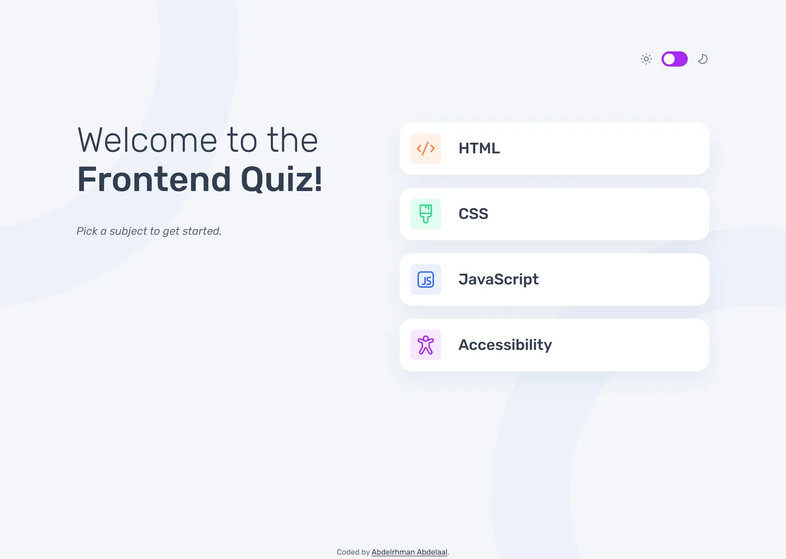

# Frontend quiz app

My solution to the [Frontend quiz app](https://www.frontendmentor.io/challenges/frontend-quiz-app-BE7xkzXQnU)
challenge on Frontend Mentor.

- Live: https://frontend-quiz-app.abdelrhman-ahmed8881.workers.dev
- Code: https://github.com/MrBlackvanta/frontend-quiz-app

## Built with

- Next.js 16, App Router
- React 19 and TypeScript
- Tailwind CSS v4

## Notes

### Accessibility

The answers are four native radios in a `radiogroup` labelled by the question, which
gives arrow-key navigation and the roving tabindex for free. After submitting they're
`disabled` rather than `aria-disabled`: with `aria-disabled` the arrow keys still check
the underlying radio, and a change handler that ignores it leaves the DOM's checked state
out of sync with React's.

Focus moves to the new screen's heading on every screen change. The heading has
`tabindex="-1"` and a normal focus ring, so a keyboard user can see where they landed and
a mouse user doesn't. Results are announced through a `role="status"` region and an empty
submit through `role="alert"`.

### Colour

Nine of the design's text pairings fail AA and eight non-text ones fail 1.4.11. The main
ones:

|                                   | design | built               |
| --------------------------------- | ------ | ------------------- |
| White on the correct-answer green | 1.9:1  | darker green, 4.5:1 |
| White on the wrong-answer red     | 3.5:1  | darker red, 4.5:1   |
| Option letter on the hover tile   | 4.2:1  | lighter tile, 4.5:1 |
| Error text                        | 3.2:1  | darker red, 4.7:1   |

**No single green or red works in both themes.** White text on a fill caps that fill's
luminance at 0.183, but clearing 3:1 against the dark card needs at least 0.316. The two
don't overlap, so the state fills invert with the theme. Side benefit: the design's
original green survives untouched in dark mode.

**The hover tint moved instead of the brand purple.** Lightening the tint gets there and
leaves the brand alone. Darkening the purple would have dragged the button, the progress
fill, the selected ring and the toggle along with it.

Three non-text failures ship as drawn. All three are the brand purple, and each state is
also carried by something else: the selected option by its filled letter tile and the
radio's own `checked`, the progress bar by the "Question 6 of 10" text (the bar is
`aria-hidden`), and the toggle by its knob against the track plus `aria-checked`.

### Layout

Option cards are min-height, not fixed. 34 of the 160 options contain angle brackets and
the longest token is 39 characters, which overflows at every breakpoint without `min-w-0`
on the flex item. `overflow-wrap: break-word` alone doesn't reduce a flex item's
min-content width.

Every option reserves space for its result icon whether or not it gets one. Only two of
four are ever marked, but adding a 40px icon at submit time re-wraps the answer and
shoves the rest of the page down. Reserving costs some height, and it's worth it for
nothing moving when you answer.

The desktop progress bar is aligned to the bottom of the last option card rather than
pinned to the y the design gives it, which is inside a left column frozen at a height
that doesn't survive a longer question.

Line heights in the design are stated as 100% almost everywhere, which isn't shippable
for anything that wraps. The real options run to 60 characters and wrap to three lines,
so those carry 1.5. The display heading gets `margin-block: -0.25rem`, because Figma's
100%-leading boxes have no half-leading while a CSS line box adds half at each end, and
without the trim the ink sits 4px low.

Radii are normalised, since the file draws each one two ways.

### Other

The subject is spelled "JavaScript". The design's tile says "Javascript" and `data.json`
says "JavaScript", so the data wins.

Picking a subject pushes a history entry. The design has no back control at all, so
browser back (and the phone's back gesture) is the whole affordance for changing your
mind. "Play Again" calls `history.back()` rather than dispatching a reset, so both paths
consume the same entry and can't drift apart.

Theme is applied before first paint by a blocking inline script reading `localStorage`,
falling back to `prefers-color-scheme`. The toggle knob's position comes from a `dark:`
variant on the same attribute rather than React state, which would render left during
SSR and snap right on hydration.

The theme swap is a circular sweep anchored to the toggle, and it runs both ways. It's a
`clip-path` keyframe on the view-transition pseudo-elements, and three details matter: it
has to be a CSS animation rather than one applied after `transition.ready`, because that
promise resolves a frame late and you see the new theme flash unclipped; it needs
`forwards`, or the clip reverts at the end and the old snapshot flashes back; and the
origin and radius are percentages, so the circle lands on the toggle whatever box the
browser gives the snapshot.

## Author

- [LinkedIn](https://www.linkedin.com/in/abdelrhman-vanta/)
- [UpWork](https://www.upwork.com/freelancers/mrblackvanta)
- [Frontend Mentor](https://www.frontendmentor.io/profile/MrBlackvanta)
